<div align="center">



# FMCG AI Portfolio — Blueprint + Three Working Systems

**30 AI use-cases, scored and prioritised — and the three that were actually built to prove the numbers.**


*Most AI strategy decks stop at the slide. This one ships the code: three working prototypes sit behind the three biggest business cases, so the claims can be **checked** rather than believed.*

</div>

---

## TL;DR

An AI-transformation portfolio for **a large FMCG business** — a prioritised map of *where* AI pays off, plus running software that proves the top three cases. Everything runs on one laptop, offline, with no API key. Every number below is either **measured by a test in this repo** or a **labelled estimate with its basis written down** — nothing is asserted.

> **▶ Try it live in your browser:** [**fmcgai.netlify.app**](https://fmcgai.netlify.app/) — the landing page has three *playable* demos (drag the cockpit sliders, flip the assistant's role gate, work the invoice queue). They run fully client-side on the **real engine output**. The complete Python systems run locally via `START_ALL.bat`.

```text
Windows:  double-click  files practice/START_ALL.bat   →   it opens HOME.html
Anything else:  see "Run it" below
```

---

## The three systems — and their verified results

| System | The business problem | What it proves (measured) |
|---|---|---|
| 📈 **Demand Cockpit** | Planners guess what will sell; promos run on instinct | Forecast error **9.0%** vs **18.3%** for the usual method. Test a promo before committing — reconciled + re-optimised answer in **~30 ms** |
| 💬 **Company Assistant** | Staff can't find answers across policies + data; sensitive numbers leak | Every answer **cited**. Margin data is **refused** to Operations, **served** to Executives — enforced at two layers, not promised. **25/25** on its evaluation, **zero** role leaks |
| 🧾 **Invoice Checker** | Every invoice gets human eyes, most for no reason | **40/40** decisions match ground truth · **13/13** planted problems caught · **67.5%** clear automatically with **zero** wrong auto-approvals |

> **Modelled portfolio value: ₹9.7 cr (conservative) / ₹17.9 cr (base) / ₹26.2 cr (aggressive) net per year.**
> These are *estimates*, not measured results — every input is traced in [`ASSUMPTIONS.md`](ASSUMPTIONS.md), and the week-1 plan to re-base them against real data is in [`2026-07-12-data-audit-pack.md`](2026-07-12-data-audit-pack.md). The prototype metrics in the table above **are** measured.

**Start here → [`2026-07-12-portfolio-home.html`](2026-07-12-portfolio-home.html)** — the front door to the blueprint, the 14-slide board deck, and the three live apps.

---

## Why this stands out

- **Strategy *and* proof in one repo.** A board-ready blueprint (30 scored use-cases, a live ROI aggregator, an interactive prioritiser) sits next to the running code for its top three bets.
- **Measured, not claimed.** A test suite gates every system; this README quotes only what those tests print. Where a number is an estimate, it says so and links its basis.
- **Honest by construction.** A self red-team downgraded two of its own source claims rather than defend them ([`REDTEAM_FIXES.md`](REDTEAM_FIXES.md)); ground-truth files are provably absent from the decision code (enforced by a test).
- **Accessible interfaces.** Each app was rebuilt around a large-type, plain-language "Clarity" design — one-click scenarios, guided steps, big controls — with full functionality intact.

---

## For engineers

Three independent Python services. No cloud dependency, no API key. Each runs a deterministic **rules-mode** by default; an optional LLM layer is strictly additive and never decides.

| Service | Port | Core idea |
|---|---|---|
| **Demand Cockpit** | `8765` | Hierarchical forecast (champion-mix per SKU) → price elasticities recovered from matched-control promo analysis → LP allocation under capacity + cash-budget limits. Every scenario **reconciles** before it renders — nothing skips the maths. |
| **Company Assistant** | `8770` | Governed RAG + text-to-SQL. A semantic layer is the *only* queryable surface; generated SQL is validated read-only against allow-lists **before** execution, and role scope is enforced twice — retrieval tags **and** column policy. No citation, no claim. |
| **Invoice Checker** | `8780` | Invoice → PO → GRN matching with **Platt-calibrated** confidence (Brier 0.266 → 0.215). Human decisions retune the auto-approve gate, capped at 0.06 / round — trust is earned gradually, never granted. |

### Design principles (enforced in code)
1. **A frozen deterministic core is the truth** — models/rules are computed and read-only; presentation layers never write into them.
2. **One-way state** — a single pipeline writes each snapshot; every consumer only reads.
3. **Every change is an intent that must reconcile before it applies** — no lever, query or upload bypasses validation.
4. **Never stops** — bad or missing input degrades to *warn + fallback + a completeness badge*, never a silent or fatal failure.

### Run it

**Windows (easiest):** double-click **`files practice/START_ALL.bat`** — it installs the four packages, starts all three servers, and opens **`HOME.html`**.

<details>
<summary><b>Run manually</b> (any OS, Python 3.12)</summary>

```bash
cd "files practice"
python -m pip install pandas numpy matplotlib openpyxl

# each in its own shell
cd ds-demand-cockpit/ds-demand-cockpit   && python src/server.py                              # :8765
cd ds-copilot/ds-copilot                 && python src/db.py && python src/server.py 8770      # :8770
cd ds-doc-to-decision/ds-doc-to-decision && python src/calibrate.py && python src/server.py 8780  # :8780
```
Then open **http://localhost:8765**, **:8770**, **:8780** — or just open `HOME.html`.
</details>

<details>
<summary><b>Run the test gates yourself</b></summary>

```bash
# forecasting: 10 gates, ~2–3 min
cd "files practice/ds-demand-cockpit/ds-demand-cockpit"   && python tests/run_tests.py
# assistant: expect  SCORE 25/25 · leaks 0
cd "files practice/ds-copilot/ds-copilot"                 && python tests/eval_harness.py
# invoice robot: expect  40/40 · planted 13/13
cd "files practice/ds-doc-to-decision/ds-doc-to-decision" && python tests/gate_m3.py
```
Windows: `files practice/RUN_ALL_TESTS.bat` runs all of the above.
</details>

**Optional AI layer.** Add an OpenRouter key to make answers read naturally, drive the cockpit in plain English, and explain flagged invoices — always behind a citation / rules guard and a hard budget cap. See [`files practice/SETUP_LLM.md`](files%20practice/SETUP_LLM.md). Everything works fully without it.

---

## Honest limits

- **Data is synthetic** (seeded generators, `SEED=42`). The pipelines are real; the numbers they produce describe *generated* data, not any real company's books.
- **The ₹ figures are modelled** and deliberately not presented as measured. Two source claims were downgraded during self-review rather than defended — see [`REDTEAM_FIXES.md`](REDTEAM_FIXES.md).
- **Prototypes are demonstrators, not production** — no auth, no HA, single-node, `127.0.0.1` only.
- The strategy blueprint includes a **worked example** on one listed Indian FMCG using **only publicly-sourced facts** (each tagged and cited); it is independent analysis, not affiliated with or endorsed by any company.

---

## Repo map

| Path | What |
|---|---|
| [`2026-07-12-portfolio-home.html`](2026-07-12-portfolio-home.html) | **Start here** — front door to everything |
| [`2026-07-12-fmcg-blueprint.html`](2026-07-12-fmcg-blueprint.html) | Master artifact — 7 tabs, live ROI aggregator, interactive prioritiser |
| [`2026-07-12-blueprint-deck.html`](2026-07-12-blueprint-deck.html) | 14-slide board deck (prints clean to PDF) |
| [`2026-07-12-exec-onepager.md`](2026-07-12-exec-onepager.md) | 3-minute CXO memo |
| `files practice/` | The three prototypes, `START_ALL.bat`, `HOME.html`, `SETUP_LLM.md` |
| [`ASSUMPTIONS.md`](ASSUMPTIONS.md) · [`REDTEAM_FIXES.md`](REDTEAM_FIXES.md) · [`MORNING_REPORT.md`](MORNING_REPORT.md) | Audit trail — what was built, what was wrong, what was assumed |

---

<div align="center">
<sub>Independent portfolio project · synthetic test data · built and measured, not asserted.</sub>
</div>
