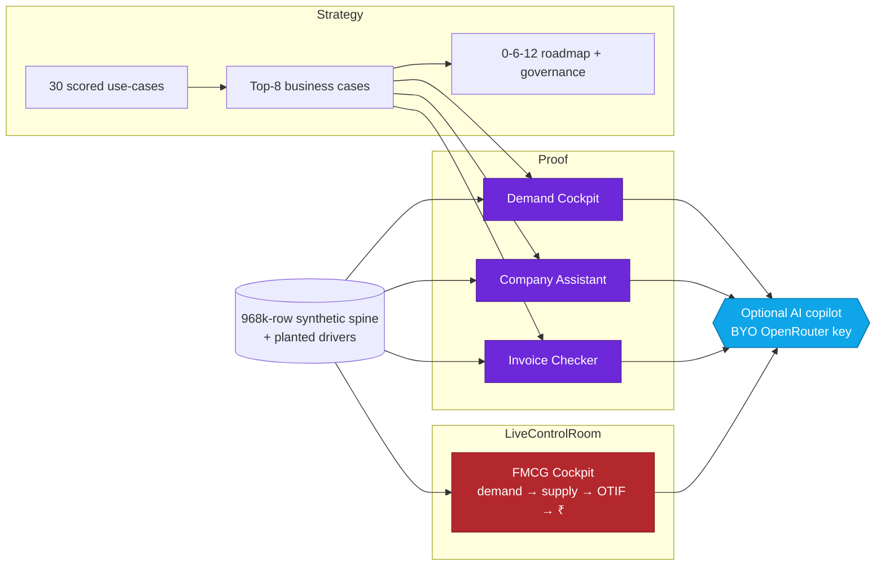
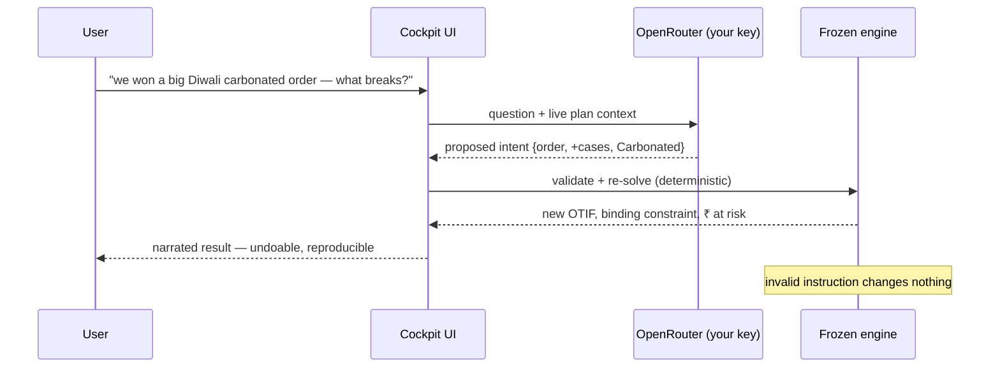
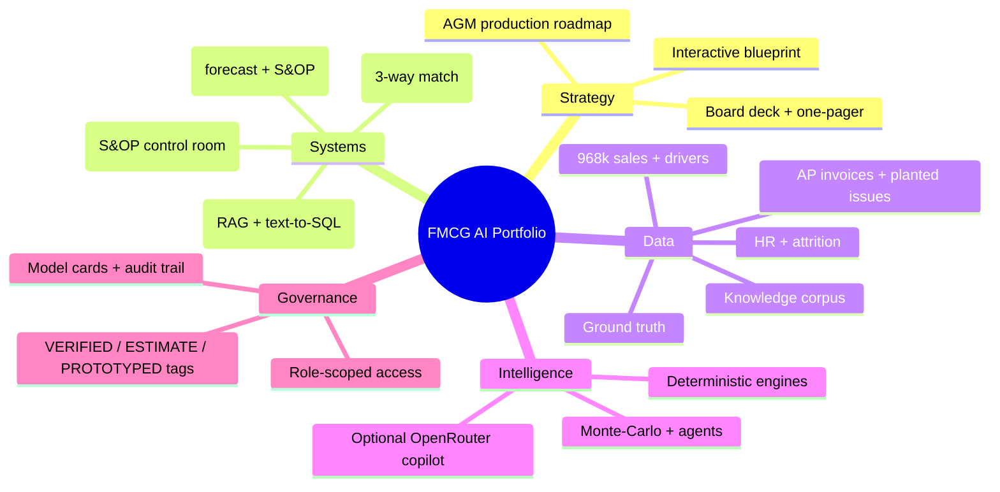
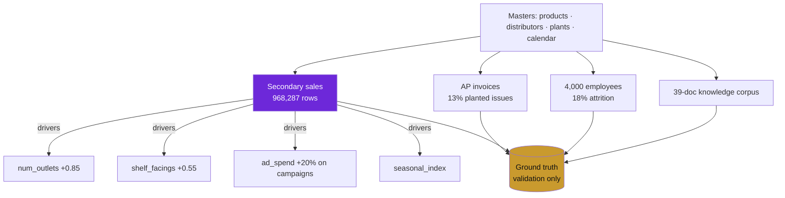
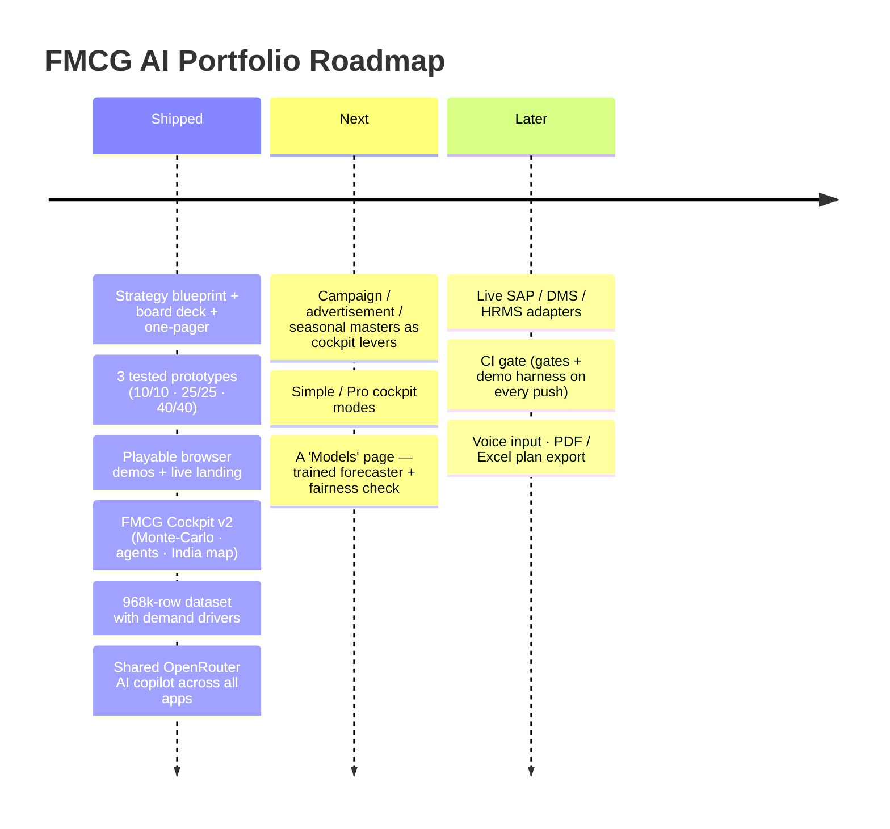

<p align="center">
  
</p>

<div align="center">

<a href="#-flight-deck"></a>
<a href="#-measured-not-claimed"></a>
<a href="#-the-four-systems"></a>
<a href="#-launch-sequence"></a>

<br /><br />


<br /><br />


</div>

---

<a id="-flight-deck"></a>

## 🛰️ Flight Deck

**An end-to-end AI-transformation portfolio for a large FMCG business** — a prioritised map of *where* AI pays off, and the running software that proves the top bets. Everything runs on one laptop, offline, with no API key. Every headline number is either **printed by a test in this repo** or a **labelled estimate with its basis written down** — nothing is asserted.

<table>
<tr>
<td width="25%" align="center"><br/>30 scored use-cases · live prioritiser · ROI aggregator</td>
<td width="25%" align="center"><br/>3 tested Python systems behind the top 3 cases</td>
<td width="25%" align="center"><br/>Play every system in the browser — no install</td>
<td width="25%" align="center"><br/>968k-row synthetic dataset with planted signal</td>
</tr>
</table>

> **▶ Try it live:** **[fmcgai.netlify.app](https://fmcgai.netlify.app/)** — three playable demos, a ₹10,000-cr-scale S&OP cockpit, and the interactive strategy blueprint. Connect your own OpenRouter key once and an AI copilot lights up across every app (key stays in your browser).

---

<a id="-measured-not-claimed"></a>

## 📊 Measured, Not Claimed

The differentiator: this repo quotes **only what its tests print**. Where a number is an estimate, it says so and links its basis.

<div align="center">

| System | Metric | Result | vs baseline |
|:--|:--|:--:|:--:|
| 📈 Demand Cockpit | Forecast error (WMAPE, SKU) | **9.0%** | 18.3% seasonal-naïve |
| 📈 Demand Cockpit | What-if → reconcile → re-optimise | **≤ 31 ms** | — |
| 💬 Company Assistant | Grounded-answer evaluation | **25 / 25** | with **0** role-scoped leaks |
| 🧾 Invoice Checker | Decisions vs ground truth | **40 / 40** | 13/13 planted issues caught |
| 🧾 Invoice Checker | Auto-cleared with no human | **67.5%** | **0** wrong auto-approvals |
| 🗄️ Data spine | Distribution → demand correlation | **+0.85** | driver recovered from planted signal |

</div>

<div align="center">


</div>

> **Honesty by construction:** a self red-team *downgraded two of its own source claims* rather than defend them ([`REDTEAM_FIXES.md`](REDTEAM_FIXES.md)); ground-truth files are provably absent from the decision code (enforced by a test); every ₹ figure is tagged **ESTIMATE** with a stated basis in [`ASSUMPTIONS.md`](ASSUMPTIONS.md).

---

<a id="-the-four-systems"></a>

## 🧩 The Four Systems

| System | The business problem | What it proves (measured) | Try it |
|:--|:--|:--|:--:|
| **📈 Demand Cockpit** | Planners guess what will sell; promos run on instinct | Forecast error **9.0%** vs **18.3%**; test a promo, get a reconciled + re-optimised answer in **~30 ms** | [demo](https://fmcgai.netlify.app/demo/cockpit/) |
| **💬 Company Assistant** | Answers scattered across policies + data; sensitive figures leak | Every answer **cited**; margins **refused** to Operations, **served** to Executives — enforced twice. **25/25**, **0** leaks | [demo](https://fmcgai.netlify.app/demo/assistant/) |
| **🧾 Invoice Checker** | Every invoice gets human eyes, most for no reason | **40/40** match ground truth · **13/13** planted problems caught · **67.5%** auto-cleared, **0** wrong | [demo](https://fmcgai.netlify.app/demo/invoice/) |
| **🛰️ FMCG Cockpit** | No single, consistent S&OP picture; what-ifs take days | A zero-install control room: demand→supply→capacity→OTIF→₹ re-solves in **~1 s** on any change, at **₹10,000-cr scale** | [launch](https://fmcgai.netlify.app/fmcg-cockpit.html) |

---

## 🔀 System Flow



---

## ⚛️ Feature Reactor

| Module | What it delivers | Status |
|:--|:--|:--:|
| Playable browser demos | Every system runs client-side on real engine output — no server |  |
| Deterministic core | Frozen engines; models/rules are read-only, presentation never writes into them |  |
| AI copilot (BYO key) | One OpenRouter key works across **every** app; validates every proposal against the engine |  |
| Streaming answers | Token-by-token responses in a shared floating copilot (`demo/ai.js`) |  |
| Monte-Carlo risk | 800-run OTIF confidence bands (P10/P50/P90) + fragility flags |  |
| War-room agents | Five expert agents debate and converge on one recommendation |  |
| Auto-plan | Multi-step, engine-validated plan to hit the OTIF target |  |
| Role gate | Operations sees zero ₹ — not shown, not computed into anything visible |  |
| Resilience contract | Missing/dirty data → warn + fallback + completeness badge, never a crash |  |
| Workbook-driven | Drop an Excel/CSV master; the whole chain re-solves |  |
| Synthetic data spine | 968k sales rows with distribution, facings, ad-spend, seasonality drivers + ground truth |  |

---

## 🤝 The Deterministic Contract

> The engine is deterministic; the AI only *proposes*. Every AI / slider / command becomes an **intent** the frozen core validates before it can change the plan. No second solver, no hallucinated numbers.



---

## 🏛️ Architecture



---

## 🧱 Tech Wall

<p align="center">
  
  <br/>
  
  
  
  
  
  
  
</p>

<div align="center"><i>No framework, no bundler for the demos — plain HTML + hand-written CSS + vanilla JS, so they run anywhere, even offline.</i></div>

---

<a id="-launch-sequence"></a>

## 🚀 Launch Sequence

<table>
<tr>
<td width="50%">

### ▶ Run the live apps (Windows)

```bash
# double-click, or:
cd "files practice"
START_ALL.bat
# installs deps, starts all 3 servers, opens HOME.html
```

Then open the three ports (or `HOME.html`):
```text
:8765  Demand Cockpit
:8770  Company Assistant
:8780  Invoice Checker
```

</td>
<td width="50%">

### ▶ Run the test gates yourself

```bash
cd "files practice/ds-demand-cockpit/ds-demand-cockpit"   && python tests/run_tests.py     # 10 gates
cd "files practice/ds-copilot/ds-copilot"                 && python tests/eval_harness.py  # 25/25 · 0 leaks
cd "files practice/ds-doc-to-decision/ds-doc-to-decision" && python tests/gate_m3.py       # 40/40 · 13/13
```

### ▶ Optional AI layer

Open any demo or the cockpit → **🤖** → paste an OpenRouter key. One key, every app. It stays in your browser and is sent only to OpenRouter.

</td>
</tr>
</table>

---

## 🗄️ The Data Spine

One seeded fictional company feeds every "implement-now" use-case, each with **planted signal + a ground-truth file** so a model has something real to find.



Full column dictionary → [`synthetic-data/DATA_DICTIONARY.md`](synthetic-data/DATA_DICTIONARY.md) · browse it live → [**data.html**](https://fmcgai.netlify.app/data.html)

---

## 🗺️ Project Map

```text
.
├─ index.html                     # Live landing (stats · ROI model · launch buttons)
├─ fmcg-cockpit.html              # ⭐ Zero-install S&OP control room (12 tabs, AI copilot)
├─ data.html                      # Browse the dataset (previews + downloads)
├─ 2026-07-12-fmcg-blueprint.html # Master artifact — 30 use-cases, live prioritiser, ROI
├─ 2026-07-12-blueprint-deck.html # 14-slide board deck (prints to PDF)
├─ demo/
│  ├─ ai.js                       # Shared AI copilot (one key, every demo, streaming)
│  ├─ cockpit/  assistant/  invoice/   # Playable, client-side, real engine output
│  └─ data/                       # Inlined engine output powering the demos
├─ synthetic-data/                # generate_all.py · 6 datasets · ground truth · dictionary
└─ files practice/                # The 3 Python prototypes · START_ALL.bat · SETUP_LLM.md
```

---

## 🔐 Governance & Honesty Vault

<table>
<tr><td align="center"></td><td>Every fact is a re-fetched public citation; every ₹ is an estimate with a basis; every system claim is a printed test result.</td></tr>
<tr><td align="center"></td><td>Sensitive figures are refused to the wrong role — not shown and not computed into anything visible.</td></tr>
<tr><td align="center"></td><td>The optional AI key lives in your browser's localStorage and is sent only to OpenRouter — never to this site or the repo.</td></tr>
<tr><td align="center"></td><td>Seeded generators. The pipelines are real; the numbers describe generated data. The strategy's worked example uses only public facts about one listed FMCG.</td></tr>
</table>

---

## 📈 Roadmap Console



---

<p align="center">
  
</p>

<div align="center">
  
  
  
  <br/><br/>
  <sub>Independent portfolio project · synthetic test data · not affiliated with or endorsed by any company · RAJ · 2026</sub>
</div>
